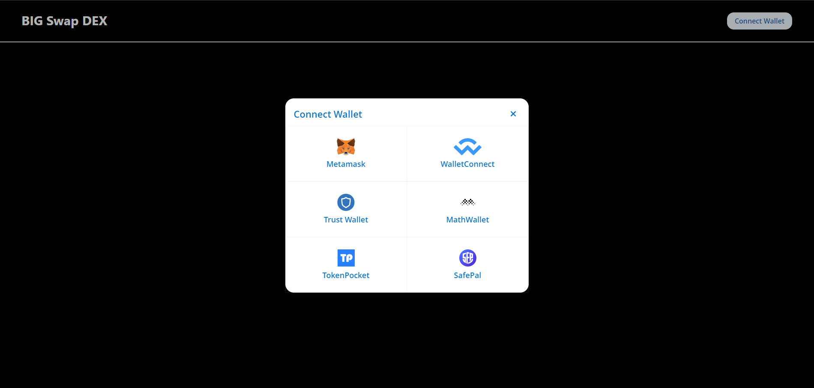

TODO:

- Finish front end, incorporate into CCBIG website.
- Use admin with multisig or .env file to store contract info. Currently, I deploy the contracts and use the resulting contract addresses as input to deploy child contracts. What can be moved needs to move into .env or an admin.js
- Deploy a backend DB to store image and production token data. Currently, BigRandomToken.sol generates tokens for testing.
- Mostly tested on Ganache or waffle. Need to test a sepolia deployment.

## **Prerequisites**

-   Node Js >= 16.14.2
-   Yarn >= 1.22.19 or npm >= 8.5.0

## **Installation**

1. Clone this repository to your local machine.
2. Install the required dependencies using `npm install` or `yarn`.
3. Compile and deploy smart contracts. May need to use petersburg EVM in compiler options.

## **Usage**

1. In the project directory, run `yarn run dev` or `npm run dev` to start the Next.js development server.

2. Navigate to `http://localhost:3000` in your browser.

## **Configuration**

Pre-configured with Next.js and Web3UIKit.

## **Next.js**

Uses Next.js, a React-based framework for building server-side rendered web applications. [here](https://nextjs.org/learn).

## **Web3UIKit**

Web3UIKit is a UI library for building Web3-enabled dApps with Ethereum. It provides a set of pre-built UI components, including buttons, forms, modals, and more, that are designed to work with Ethereum wallets and smart contracts out of the box.  [here](https://github.com/uikit/web3).

## **License**

This project is licensed under the MIT License.

